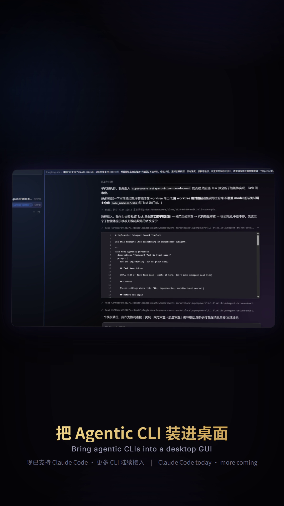

<div align="center">

# LoongCode

**把 Claude Code 装进桌面的 AI Agent IDE**

将 Claude Code CLI 包裹进一个现代化的桌面工作台 —— 多会话对话、集成终端、文件树、Git Review、命令 / 文件面板，以及 MCP、插件、技能、模型供应商的可视化管理，开箱即用。


[](https://loongcode0.github.io/loongcode-release/)

</div>

<div align="center">

### 🎬 宣传片 · 看 LoongCode 跑起来

<a href="promo-video/out/loongcode-promo.mp4">
  
</a>

<sub>▶ 点击封面播放 · 竖屏 · 约 47 秒(GitHub 会用内置播放器打开)</sub>

</div>

> 📦 **这里是 LoongCode 的官方发布仓库。** 它提供各平台安装包下载，并作为应用「自动更新」的下载源（`latest.json`）。如需源码与开发说明，请前往项目主仓库。

> 📈 **版本时间线 / 后续规划**：**<https://loongcode0.github.io/loongcode-release/>** —— 以时间线展示各版本已完成功能摘要，以及后续规划（Codex 接入 / Workflow / Agent Team 等）。

---

## LoongCode 是什么

**LoongCode** 是一个基于 **Tauri 2 + React 19** 的跨平台桌面应用，本质上是 **Claude Code CLI 的图形化外壳**。

它把命令行里的 Agent 编程体验，搬进了一个真正的 IDE 式界面：

- 每一个「任务」对应一个独立的 Claude Code 会话；
- 应用以子进程方式拉起 `claude` CLI，通过 stdin/stdout 以 stream-json 协议通信；
- 把事件流实时渲染成对话 UI，并在同一个窗口里集成终端、文件树、Git Review、命令 / 文件面板，以及各类设置。

> ⚠️ **重要：LoongCode 自身不直接调用 Anthropic API。** 所有模型交互都由它拉起的 CLI 子进程完成。因此在使用前，你需要先在本机准备好两个**必备依赖**：已安装并登录的 **Claude Code CLI**，以及 **Git**。
>
> 👉 没装也不必离开应用：LoongCode 内置**「依赖管理」**面板，可直接一键安装 Claude Code CLI 与 Git（见下方「系统要求」与「🧩 依赖与一键安装」）；登录仍需你在装好后自行完成。

---

## ✨ 核心功能

### 会话与任务
- **多工作区 / 多任务管理** —— 每个任务都是一个独立、可恢复的 Claude Code 会话；任务列表按最近活动排序，在用的任务自动浮上来。
- **分屏对话（多分栏）** —— 主区可把对话切成多个分栏（左右 / 上下递归平铺、分割线可拖、可关闭塌缩、**拖分栏标题可停靠 / 交换重排**），每个分栏是一个完整对话或新建草稿，可**跨工作区自由混排**；选中分栏时侧栏 / 文件 / 终端 / Git 自动跟随，布局会被记住，误关可 `Ctrl+Shift+T` 撤销。
- **任务归档** —— 不再活跃的任务可手动（下拉 / 右键）或按最近活动时间自动归档，收纳进独立的「归档视图」，主列表更清爽；自动归档可在设置里开关与调阈值（小时 / 天 / 月），运行中 / 置顶任务受保护。
- **新建任务草稿态** —— 点「新建」先进入草稿，内联挑选工作区 / 模型 / Git 分支或 worktree，发送首条消息才正式创建任务（`Ctrl+N` 快捷新建，默认选上次用过的工作区）。
- **历史精确还原** —— 从 Claude 的会话 JSONL 加上应用侧的 sidecar 还原对话，连用户输入里的文件、命令、图片 chip 身份都能 1:1 复原。
- **会话分叉 / 优雅中断 / 重跑** —— 从任意历史节点 fork 出新会话；点「停止」等价于按 ESC 优雅中断，保留已生成内容、可继续对话。
- **编辑历史用户消息**，并从该点继续。
- **子 Agent 子对话** —— 子 Agent 的对话被路由进独立的折叠卡片，主线清晰不打架。
- **移动端支持（微信 ClawBot / 飞书 Lark）** —— 绑定微信官方 ClawBot 或飞书机器人后，用手机即可远程新建 / 驱动任务、接收 AI 回复，连交互式提问（AskUserQuestion）也能回数字作答。飞书渠道为**原生 Rust 长连接**实现：扫码建应用绑定、私聊全转发 / 群里 @ 机器人触发、连接健康指示灯（绿 / 黄 / 灰），网络波动自动重连且不丢凭据。

### 对话体验
- **富文本消息气泡** —— Markdown 渲染、表格、代码语法高亮、Markdown 预览。
- **工具调用可折叠卡片** —— Read / Write / Edit 的 diff、WebSearch 结果等，一目了然又不占地方。
- **交互式提问（AskUserQuestion）** —— 在 UI 里直接点选选项，支持「其他」自定义输入。
- **AI 消息工具栏**、对话内链接用系统浏览器打开、任务状态与未读指示。

### 输入（Composer）
- **斜杠命令面板**（`/command`）与 **@ 文件提及面板**、内联文件 chip。
- **图片输入**、**每任务独立草稿**、**模型 / 推理强度选择器**、可自定义的输入工具栏。

### 集成开发工具
- **集成终端** —— 基于 xterm.js + PTY 的真实终端。
- **文件树侧栏 + 侧边文件面板 + Monaco 编辑器** —— 浏览、查看代码与 Diff。
- **文件树多选与文件操作** —— 单击选中 / 拖拽框选，复制 / 剪切 / 粘贴（接入系统文件剪贴板，与资源管理器互通）、新建 / 重命名 / 删除，支持 `Del` 与 `Ctrl+C/X/V` 快捷键。
- **Git 工作流** —— 分支切换、变更 Review 面板、提交菜单（含 ✨ 一键生成提交消息）、worktree 自动检测与跟随。
- **内嵌浏览器面板** —— 在右侧面板直接打开网页，支持多标签、跨任务共享，查文档 / 预览页面无需离开应用。
- **在文件资源管理器中打开**当前工作区。

### 配置与扩展
- **Skills（技能）/ MCP 服务器 / Plugins（插件）/ 子智能体（Subagents）** 的可视化管理 —— 子智能体支持**用户 / 项目 / 插件**三作用域的查看、新建、编辑、删除与启停（插件提供者只读）。
- **Model Providers（模型供应商）** 配置，自由切换后端 —— 常见模型内置**上下文窗口出厂默认值**，新增模型时输入框占位符直接给出推荐值（留空也有合理默认）。
- **依赖管理 + 运行时版本管理** —— 依赖按必须 / 可选分层呈现；**必备依赖 Claude Code CLI 与 Git 支持应用内一键安装**（Windows 直接装好，macOS 的 Git 走系统 Xcode 命令行工具引导）；对 `uv` / `pnpm`（及 `bun`）可列出 / 安装 / 卸载 / 切换多版本，并支持一键兜底安装。
- **代理设置** —— 支持 http / https 代理（不支持 SOCKS）。
- **环境变量设置** —— 为 Claude Code CLI 子进程注入自定义环境变量（改动自动触发子进程重启）。
- **用量统计（Usage）** —— 直观查看消耗。

### 桌面体验
- **全应用自定义右键菜单** —— 对话区、预览、文件树、任务行、侧边栏空白处都有贴合场景的右键菜单，替换系统默认菜单。
- **后台任务栏提醒** —— 窗口不在前台（含最小化）时，AI 完成 / 失败 / 弹出确认请求会像 QQ / 微信那样闪烁任务栏图标。
- **新建任务记住上次配置** —— 新建任务 / 技能自动继承上一次使用的模型供应商与参数。
- **无边框透明窗口** + 亚克力 / vibrancy 模糊，失败时优雅降级。
- **深色主题**、蓝紫渐变视觉、金色 wordmark。
- **界面语言（中 / 英）** —— 整个图形界面支持中英文切换，默认跟随系统语言、识别不到时回退英语，可在「设置 → 常规」随时切换；AI 对话内容不受影响。
- **中 / 英文安装界面**，安装时可选语言。
- **内置自动更新** —— 启动后静默检查并提示升级。
- **新手引导（Onboarding Tour）** —— 第一次使用不迷路。

---

## 💻 系统要求

| 项目 | 说明 |
| --- | --- |
| **操作系统** | Windows 10/11（x64 / ARM64）、macOS（Apple Silicon 与 Intel，Universal） |
| **必备依赖** | **Claude Code CLI**（已安装并完成登录 / 配置）与 **Git**；两者均可在应用内一键安装 |
| **网络（可选）** | 如需走代理，仅支持 http / https 代理（不支持 SOCKS） |

> 💡 **没装这两个依赖也没关系**：装好 LoongCode 后进入 **设置 →「依赖管理」**，即可一键安装 Claude Code CLI 与 Git，无需手动折腾命令行（详见下方「🧩 依赖与一键安装」）。
>
> 实际可下载的安装包，请以本仓库 [Releases](../../releases) 页面的产物为准。

---

## 📥 下载与安装

1. 打开本仓库的 **[Releases](../../releases)** 页面。
2. 选择与你的系统匹配的安装包下载：
   - **Windows**：NSIS 安装程序（`.exe`），安装向导内置中 / 英文界面。
   - **macOS**：磁盘镜像（`.dmg`）/ 应用包。
3. 运行安装包，按向导完成安装。
4. 首次使用前，确保本机已安装 **Claude Code CLI**（并登录）与 **Git**；若尚未安装，可在启动后到 **设置 →「依赖管理」** 一键安装（见下方「🧩 依赖与一键安装」）。

> 若系统弹出来源安全提示（Windows SmartScreen / macOS Gatekeeper），按系统指引选择继续运行即可。

---

## 🧩 依赖与一键安装

LoongCode 运行需要两个**必备依赖**：

- **Claude Code CLI** —— 提供模型能力（应用本身不直接调用 Anthropic API）。
- **Git** —— 驱动分支切换、变更 Review、worktree 等 Git 工作流。

本机还没装也没关系，**无需手动敲命令行**：打开 LoongCode，进入 **设置 →「依赖管理」**，在「必须依赖」分组里就能看到它们的安装状态，点 **「安装」** 即可一键装好。

| 必备依赖 | Windows | macOS |
| --- | --- | --- |
| **Claude Code CLI** | 一键安装（官方安装脚本） | 一键安装（官方安装脚本） |
| **Git** | 一键安装（便携版 PortableGit，装入应用目录） | 点「触发系统安装」调起系统 Xcode 命令行工具安装；也可自行 `brew install git` |

- 安装过程实时显示日志，完成后自动重新检测状态。
- 代理环境下，可在该面板为依赖单独配置 http / https 代理后再安装。
- 「可选依赖」`uv` / `pnpm` / `bun` 同样支持一键安装与多版本切换。

> ⚠️ 应用只能帮你把 Claude Code CLI **装好**，**登录仍需自行完成**：在集成终端运行 `claude` 按提示登录，或在 **设置 →「模型供应商」** 配置你的后端。

---

## 🚀 快速开始

1. **准备依赖** —— 装好 Claude Code CLI 与 Git 并登录 CLI；没装也可以先打开 LoongCode，到 **设置 →「依赖管理」** 一键安装。
2. **安装并打开 LoongCode**。
3. **添加工作区** —— 指向你的项目目录。
4. **新建任务** —— 输入需求，回车即开始一个 Claude Code 会话。
5. 在右侧用**终端、文件树、Git Review** 跟进改动，在设置里按需接入 **MCP / 插件 / 技能 / 模型供应商**。

---

## 🔄 自动更新

LoongCode 内置 [Tauri Updater](https://v2.tauri.app/plugin/updater/)。应用会向本仓库的发布源拉取更新清单：

```
https://github.com/LoongCode0/loongcode-release/releases/latest/download/latest.json
```

检测到新版本时会提示用户，Windows 端采用 passive（静默）安装模式，更新过程基本无感。

---

## ❓ 常见问题

**Q：本机还没装 Claude Code CLI 或 Git，必须手动装吗？**
A：不用。打开 LoongCode 后进入 **设置 →「依赖管理」**，在「必须依赖」里点「安装」即可。Windows 上 Claude Code CLI 与 Git 都能直接装好；macOS 上 Git 会调起系统 Xcode 命令行工具安装。装好 Claude Code CLI 后记得完成登录。

**Q：装好后无法对话 / 没有任何模型响应？**
A：LoongCode 不自带模型能力，它依赖本机的 Claude Code CLI。请确认 `claude` 已安装、在 PATH 中、并已完成登录。

**Q：公司网络需要代理怎么办？**
A：在应用设置中配置 http / https 代理。注意被拉起的 CLI 仅支持 http/https，不支持 SOCKS。

**Q：更新检查不到新版本？**
A：自动更新依赖本仓库 Releases 的 `latest.json`，请确认网络可访问 GitHub。

---
